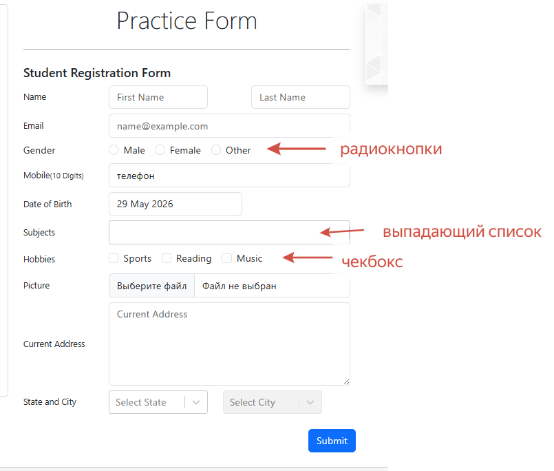

# Student Registration Form 

Автоматизированные тесты для проверки формы регистрации студентов на [DemoQA](https://demoqa.com/automation-practice-form).

---

## 🛠️ Технологический стек

| Инструмент       | Назначение                                      |
|------------------|-------------------------------------------------|
| `Java 17`        | Язык программирования                           |
| `Selenide`       | UI-фреймворк (обёртка над Selenium WebDriver)   |
| `JUnit 5`        | Тест-раннер и система утверждений               |
| `Gradle`         | Сборка проекта и управление зависимостями       |
| `Chrome`         | Браузер для выполнения тестов                   |

---

## 🧪 Тестовые сценарии

### ✅ Позитивные проверки
- **`requiredFieldsOnlyFormFillTest`** — заполнение только обязательных полей, успешная отправка формы
- **`successfulFullFormFillTest`** — полное заполнение всех полей (Subject, Hobbies, Address, State/City, Date of Birth)

### ❌ Негативные проверки
- **`negativeTest_EmptyRequiredFieldsShowRedBorders`** — отправка пустой формы, проверка появления красной рамки у обязательных полей
- **`negativeTest_InvalidPhoneNumberShowsRedBorder`** — ввод букв в поле телефона, проверка подсветки ошибки валидации
- **`negativeTest_WrongDataSubmission`** — проверка, что модальное окно результатов **не** появляется при невалидных данных

---

## 🚀 Форма регистрации

